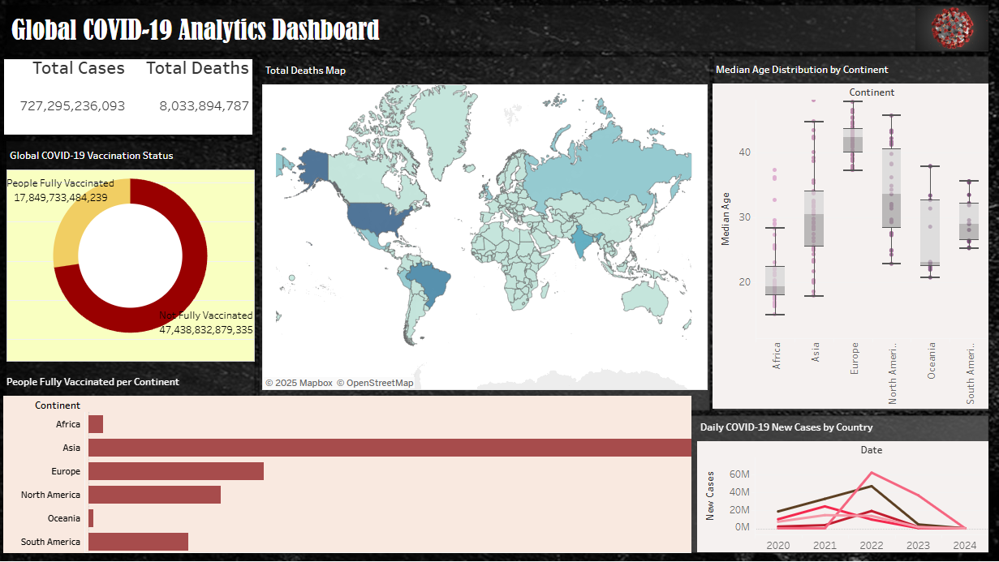

# 🌍 Global COVID-19 Analytics Dashboard

This interactive Tableau dashboard provides a comprehensive analysis of the global impact of the COVID-19 pandemic, including confirmed cases, death toll, vaccination progress, demographic breakdowns, and geographical insights.

 

## 🖼 Dashboard Preview

 

## 📊 Dashboard Highlights

The dashboard includes the following visualizations:

### 1. ✅ **Global KPI Scorecards**
- 🟡 **Total Cases**
- 🔴 **Total Deaths**

These KPIs give a quick overview of the overall pandemic impact.

---

### 2. 🗺️ **Total Deaths by Country (Map)**
- A filled choropleth map showing total COVID-19 deaths by country.
- Uses color intensity to highlight severity across regions.

---

### 3. 🍩 **Vaccination Status – Doughnut Chart**
- People Fully Vaccinated vs Not Fully Vaccinated.
- Clean and easy-to-compare visual to understand global vaccination coverage.

---

### 4. 📦 **Median Age Distribution by Continent (Box Plot)**
- Helps analyze how population age structures vary by continent.
- Useful for understanding vulnerability to the virus.

---

### 5. 📈 **New COVID-19 Cases Over Time**
- A line chart showing daily new cases by country across the years.
- Helps track pandemic waves and global surges.

---

### 6. 📉 **People Fully Vaccinated per Continent (Bar Chart)**
- Breakdown of vaccination progress by continent.
- Highlights disparities across regions.

---

## 🧹 Data Cleaning & Preparation

- Used the **Our World in Data COVID-19 dataset**.
- Filtered to remove null values, aggregate totals, and calculate vaccination gaps.
- Filtered out the locations like high-income countries, low-income countries, etc wherever needed.

---

## 🛠 Tools Used

- **📊 Tableau Public** – Dashboard creation and interactive visualizations
- **📁 Microsoft Excel / Google Sheets** – Preprocessing and data cleaning
- **Microsoft Powerpoint** - to make background

---

## 🌐 Live Dashboard

🔗 [View on Tableau Public](https://public.tableau.com/app/profile/nithya.reddy.banala/vizzes)  

---

## 🧠 Key Insights

- Significant variation in death tolls across continents.
- Africa and Oceania have relatively younger populations.
- Some countries show sharp pandemic waves in 2021 and 2022.
- Vaccination remains uneven globally, even late into the pandemic timeline.

---

## 📌 Author

**B. Nithya Reddy**  
Final Year Student | Data Enthusiast | Tableau Developer

📧 [https://www.linkedin.com/in/nithya-reddy-banala-12316a2b9/]  
📍 ICFAI Tech, Hyderabad

---

## 📎 License

This project is for educational and portfolio purposes only.  
Data source: [Our World in Data – COVID-19](https://ourworldindata.org/coronavirus)
